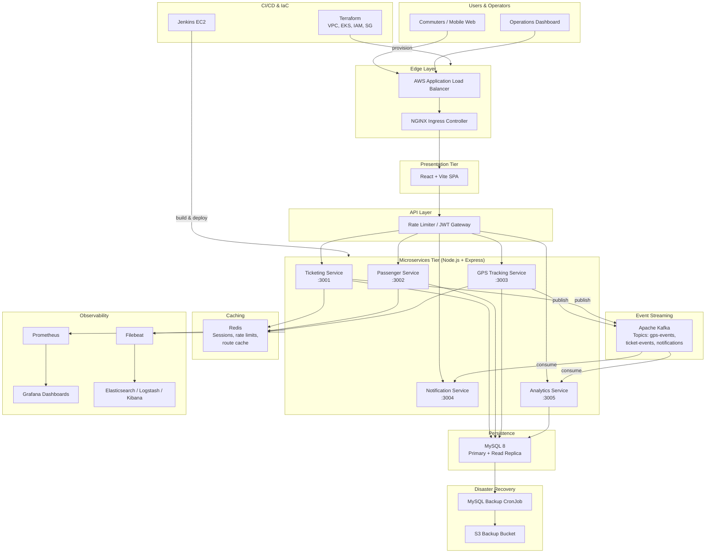
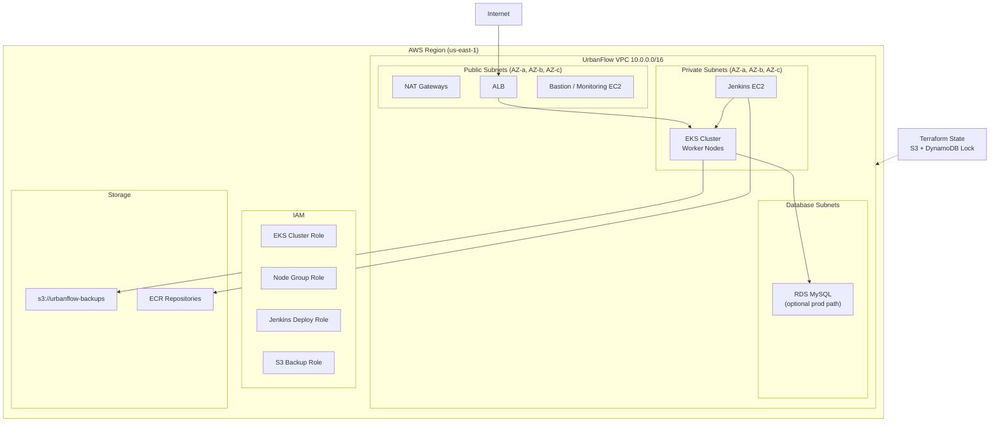
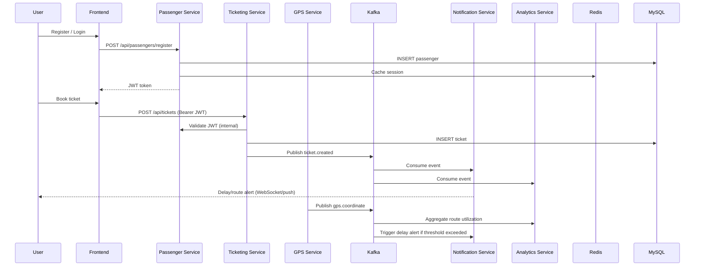
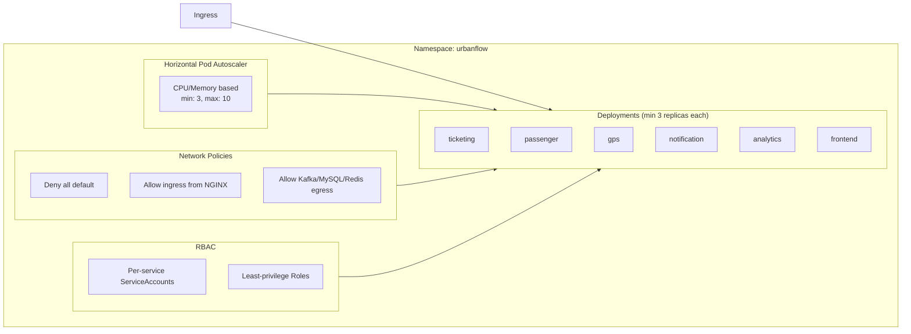
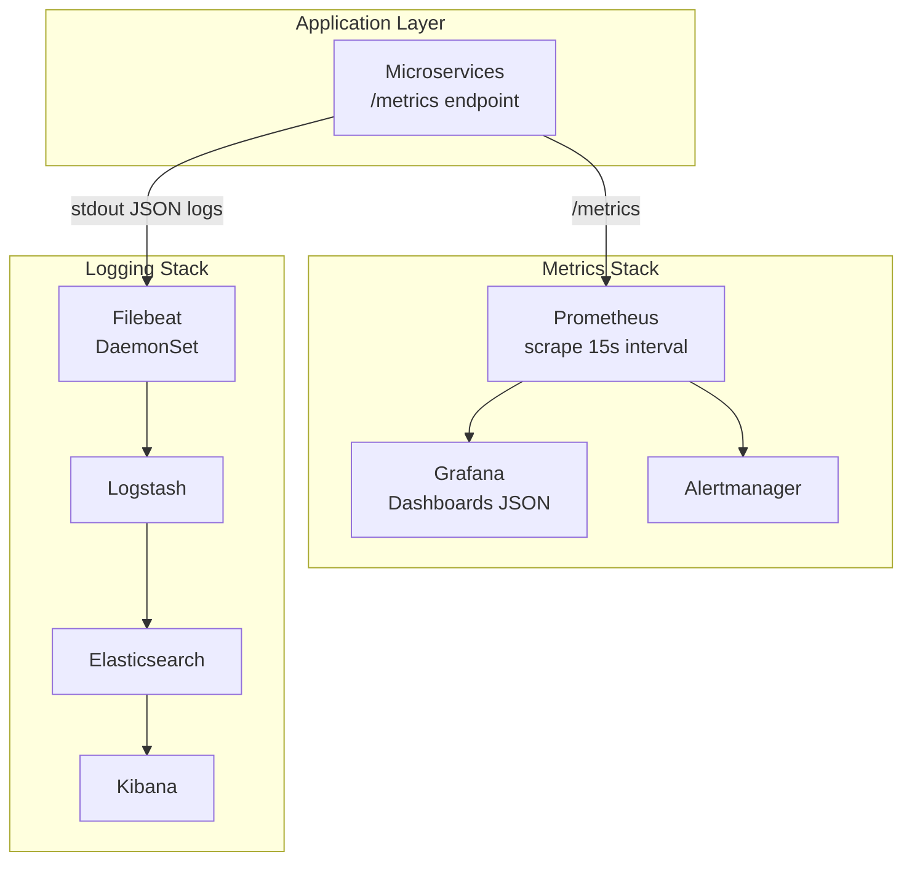
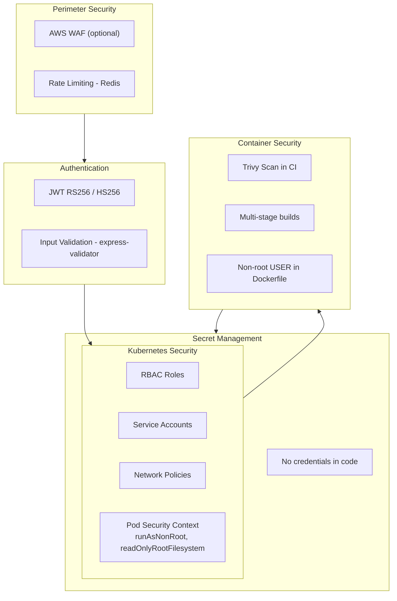
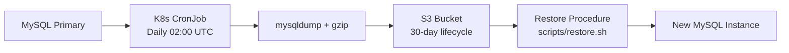

# UrbanFlow – Architecture Design

> **Intelligent Public Transportation Platform**  
> Cloud-native microservices architecture for bus, metro, and EV fleet management at scale.

---

## 1. Executive Summary

UrbanFlow is a production-style transportation management platform designed to support millions of commuters. It demonstrates enterprise DevOps practices: Infrastructure as Code (Terraform), containerization (Docker), orchestration (Kubernetes), CI/CD (Jenkins), observability (Prometheus/Grafana, ELK), and security hardening (RBAC, Network Policies, Trivy).

The platform is **dual-mode**:
- **Local development**: Docker Compose runs all services, databases, and observability stacks on a single machine.
- **Production deployment**: Terraform provisions AWS infrastructure; Kubernetes runs microservices on EKS with HA, autoscaling, and disaster recovery.

---

## 2. High-Level Architecture

---

## 3. AWS Infrastructure Architecture

---

## 4. Microservices Communication

---

## 5. Service Responsibilities

| Service | Port | Database Schema | Kafka Topics (produce/consume) | Redis Usage |
|---------|------|-----------------|--------------------------------|-------------|
| **Ticketing** | 3001 | `ticketing_db` | produce: `ticket-events` | ticket validation cache |
| **Passenger** | 3002 | `passenger_db` | produce: `passenger-events` | JWT blacklist, sessions |
| **GPS Tracking** | 3003 | `gps_db` | produce: `gps-events` | live vehicle positions |
| **Notification** | 3004 | `notification_db` | consume: `gps-events`, `ticket-events`, `system-events` | notification dedup |
| **Analytics** | 3005 | `analytics_db` | consume: all event topics | aggregated stats cache |

---

## 6. Data Flow Patterns

### 6.1 Synchronous (REST)
- Frontend → Ingress → Microservice for CRUD operations
- Inter-service auth validation via internal HTTP + shared JWT secret (K8s Secret)

### 6.2 Asynchronous (Event-Driven)
- GPS and Ticketing services publish domain events to Kafka
- Notification and Analytics services consume asynchronously
- Decouples peak GPS telemetry from notification delivery

### 6.3 Caching Strategy
- **Redis**: Session tokens, rate-limit counters, hot route data, live GPS snapshots (TTL 30s)
- **Cache-aside** pattern for ticket validation

---

## 7. Kubernetes Architecture

---

## 8. CI/CD Pipeline Architecture

```mermaid
flowchart LR
    Git["Git Push"] --> Jenkins["Jenkins Pipeline"]
    Jenkins --> S1["1. Checkout"]
    S1 --> S2["2. Install Dependencies"]
    S2 --> S3["3. Unit + Integration Tests"]
    S3 --> S4["4. ESLint Static Analysis"]
    S4 --> S5["5. Docker Build (multi-stage)"]
    S5 --> S6["6. Trivy Security Scan"]
    S6 --> S7["7. Push to ECR"]
    S7 --> S8["8. kubectl apply to EKS"]
    S8 --> S9["9. Smoke Tests"]
    S9 --> Done["Deploy Complete"]
```

---

## 9. Observability Architecture

### Key Metrics
| Metric | Source | Alert Threshold |
|--------|--------|-----------------|
| CPU Usage | cAdvisor / kube-state-metrics | > 80% for 5m |
| Memory Usage | cAdvisor | > 85% for 5m |
| API Request Rate | Express prometheus middleware | baseline + 3σ |
| API Latency p99 | Histogram | > 500ms |
| Error Rate | HTTP 5xx counter | > 1% |
| Active Users | Passenger service gauge | informational |
| Ticket Creation Rate | Ticketing counter | informational |
| GPS Events/sec | GPS service counter | > 10k/s spike alert |

---

## 10. Security Architecture

---

## 11. High Availability & Fault Tolerance

| Concern | Mitigation |
|---------|------------|
| Traffic spikes | HPA (3–10 replicas), Redis cache, Kafka buffering |
| Container crashes | Liveness probes, restartPolicy Always, 3+ replicas |
| Node failures | Pod anti-affinity across AZs, EKS managed node groups |
| Deployment failures | Rolling updates, readiness probes, automatic rollback |
| Database outages | Connection pooling, retry with exponential backoff, daily S3 backups |
| Kafka broker failure | Replication factor 3 (prod), min.in.sync.replicas=2 |
| Cybersecurity | JWT, rate limiting, Trivy, RBAC, NetworkPolicies, input validation |

---

## 12. Disaster Recovery

**RTO Target**: 4 hours | **RPO Target**: 24 hours (daily backups)

---

## 13. Technology Stack Summary

| Layer | Technology |
|-------|------------|
| Frontend | React 18, Vite, TypeScript, Axios |
| Backend | Node.js 20 LTS, Express 4 |
| Database | MySQL 8.0 |
| Cache | Redis 7 |
| Messaging | Apache Kafka 3.x (KRaft mode in Compose) |
| Containers | Docker multi-stage builds |
| Orchestration | Kubernetes 1.28+ / EKS |
| IaC | Terraform 1.6+ |
| CI/CD | Jenkins 2.x |
| Monitoring | Prometheus, Grafana, Alertmanager |
| Logging | ELK + Filebeat |
| Security Scanning | Trivy |
| Testing | Jest, Supertest, k6 |

---

## 14. Design Decisions (DevOps Rationale)

1. **Microservices over monolith**: Independent scaling of GPS ingestion vs. ticketing; fault isolation for university demo of distributed systems.
2. **Kafka for GPS/events**: Handles telemetry bursts without blocking HTTP handlers; enables replay for analytics.
3. **Redis for sessions + rate limits**: Sub-millisecond auth checks; protects APIs during spikes.
4. **Separate DB schemas per service**: Database-per-service pattern; avoids tight coupling (shared MySQL instance in dev, separate RDS in prod).
5. **Multi-stage Docker builds**: Smaller attack surface, faster pulls, non-root runtime.
6. **Minimum 3 replicas**: Survives single pod failure; required for meaningful HPA and rolling update demos.
7. **Terraform module layout**: Reusable VPC/EKS modules across dev/staging/prod environments.
8. **Prometheus pull model**: Industry standard for K8s; `/metrics` on every service.
9. **JSON structured logging**: Enables ELK parsing and correlation by `traceId`.
10. **Jenkins over GitHub Actions**: Explicit requirement; EC2 Jenkins mirrors enterprise on-prem CI/CD patterns.

---

## 15. Next Steps

After architecture approval, implementation proceeds in this order:

1. Shared libraries + database init scripts
2. Microservices (Passenger first → JWT → others)
3. Frontend React app
4. Docker Compose for local stack
5. Kubernetes manifests
6. Terraform modules
7. Jenkins pipeline
8. Monitoring & logging configs
9. Tests & load scripts
10. Documentation guides

See [PROJECT_STRUCTURE.md](../PROJECT_STRUCTURE.md) for the complete file tree.
